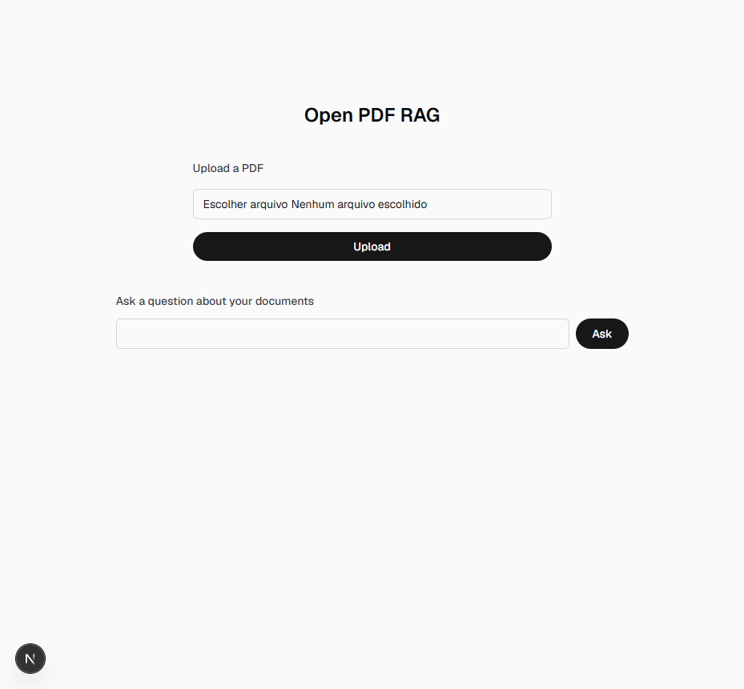
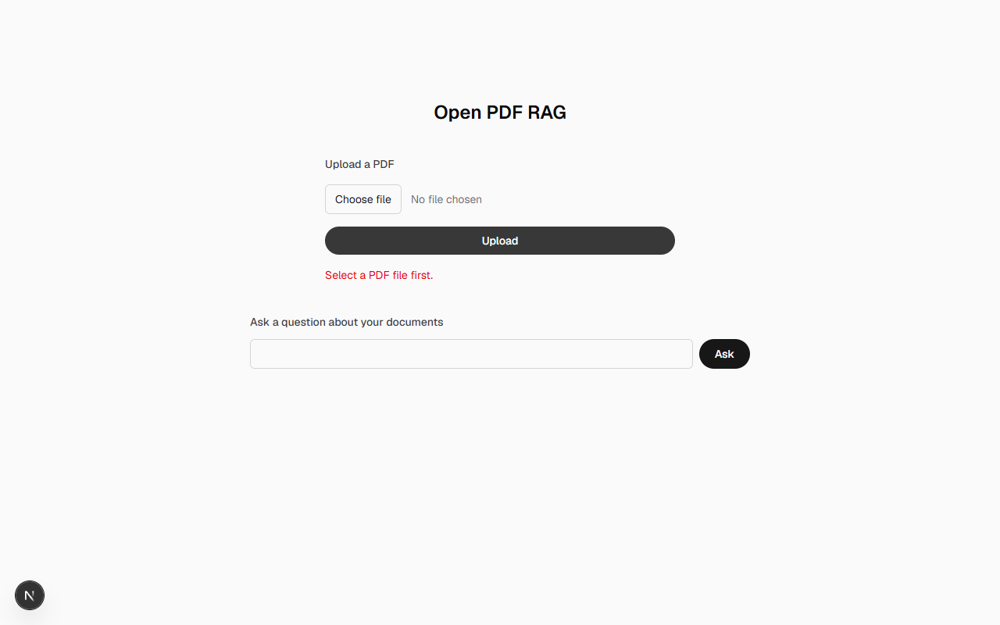
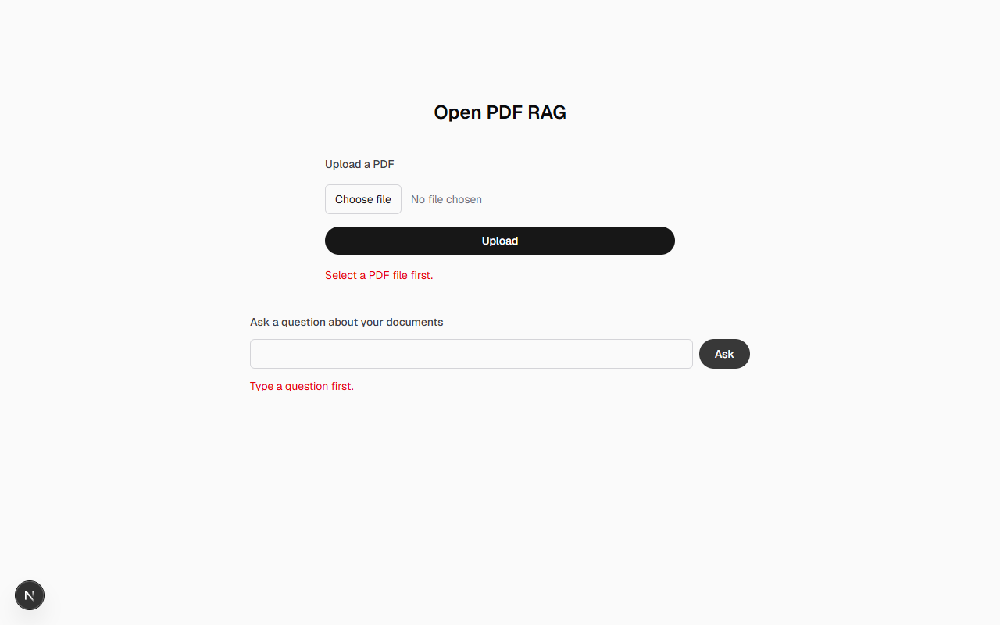
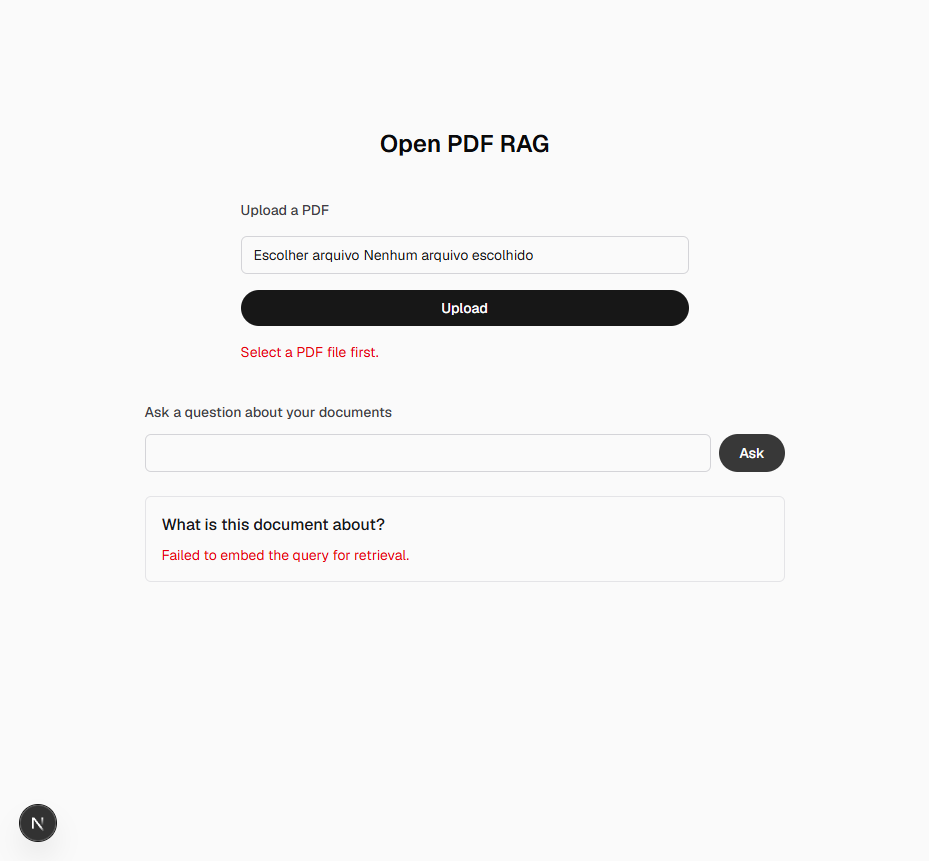
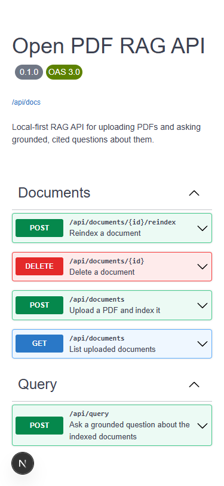
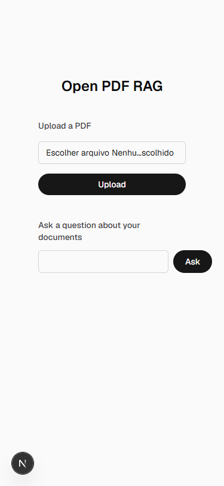

# pdf-rag

Open PDF RAG is an open-source, local-first application for chatting with PDFs, focused on source-grounded answers, page-level citations, and an explainable RAG pipeline — built entirely in JS/TS.

## Status

All 13 functional requirements are implemented (upload, parsing, chunking, embeddings, indexing, retrieval, grounded generation, citations, document lifecycle, session UI, configurable params, API docs). Architecture, requirements, and backlog are fully documented under [`.claude/docs/`](./.claude/docs/README.md).

## Stack

Next.js + TypeScript, Tailwind, Drizzle ORM, Zod, Ollama (local embeddings + LLM), pgvector/LanceDB. Full rationale: [architecture/recommended-stack.md](./.claude/docs/architecture/recommended-stack.md).

## Configuration

All runtime parameters are configurable via environment variables — no code changes needed. Set them in `.env.local` or your shell before starting the app.

| Variable | Default | Controls |
|---|---|---|
| `CHUNKING_CHUNK_SIZE` | `1000` | Max characters per chunk |
| `CHUNKING_CHUNK_OVERLAP` | `200` | Characters of overlap between consecutive chunks (must be `< CHUNKING_CHUNK_SIZE`) |
| `RETRIEVAL_TOP_K` | `5` | Number of chunks retrieved per question |
| `RETRIEVAL_SCORE_THRESHOLD` | unset (no filtering) | Drops retrieved chunks with a distance above this value |
| `OLLAMA_BASE_URL` | `http://localhost:11434` | Ollama server URL, used for both embeddings and generation |
| `OLLAMA_EMBEDDING_MODEL` | `nomic-embed-text` | Ollama model used to embed documents and queries |
| `OLLAMA_GENERATION_MODEL` | `llama3.2` | Ollama model used to generate answers |
| `GENERATION_PROVIDER` | `deepseek` | Which LLM answers questions: `ollama` (local, free) or `deepseek` (hosted, paid) |
| `DEEPSEEK_API_KEY` | unset | DeepSeek API key, required when `GENERATION_PROVIDER=deepseek` |
| `DEEPSEEK_BASE_URL` | `https://api.deepseek.com` | DeepSeek API base URL |
| `DEEPSEEK_MODEL` | `deepseek-chat` | DeepSeek model used to generate answers |
| `LANCEDB_URI` | `.lancedb` | LanceDB storage path |
| `DOCUMENTS_STORAGE_DIR` | `.data/uploads` | Where uploaded PDFs are stored on disk |
| `DOCUMENTS_MANIFEST_PATH` | `.data/documents.json` | Document registry file path |

## Screenshots

| Home — initial state | Upload validation error | Query validation error |
|---|---|---|
|  |  |  |

| Query error surfaced inline | API docs (`/docs`) | Home — mobile viewport |
|---|---|---|
|  |  |  |

Run `npm run lint:a11y` (`npm run dev` must already be running) for an automated WCAG2AA check via [Pa11y](https://pa11y.org/) — config in `.pa11yci.json`. Both `/` and `/docs` currently pass with 0 errors; `/docs`'s 8 original contrast failures (all in `swagger-ui-dist`'s default theme) are fixed via a small scoped override, `src/app/docs/docs-a11y-overrides.css`, imported after the vendor stylesheet.

### UX notes (Nielsen heuristic pass)

Captured with the Playwright MCP against a running `npm run dev`, then reviewed against Nielsen's 10 usability heuristics. Real, actionable findings:

- **Match between system and the real world (H2):** the browser tab still said "Create Next App" (leftover scaffold metadata) — fixed in `src/app/layout.tsx`.
- **Help users recognize/diagnose errors (H9):** errors now render with `role="alert"` (`UploadForm.tsx`, `QuerySession.tsx`), so screen readers announce them as soon as they appear.
- **Consistency and standards (H4):** the native file-input control used to render in the browser's OS locale (e.g. `Escolher arquivo` in a pt-BR environment). Fixed by visually hiding the native input (`sr-only`, still keyboard/label-accessible) behind a custom "Choose file" trigger button and a filename ``, both always in English.
- **Visibility of system status (H1):** "Uploading…"/"Thinking…" and the success message now sit in `aria-live="polite"` regions, so assistive tech announces status changes without waiting for focus to move.

## API Docs

Run `npm run dev` and open `/docs` for an interactive Swagger UI of every API route, generated from JSDoc comments in the route source (no separate spec file to keep in sync). The raw OpenAPI JSON is available at `/api/docs`.

## Docs

- [Documentation index](./.claude/docs/README.md)
- [Backlog](./.claude/docs/backlog.md)
- [Tasks checklist](./.claude/docs/TASKS.md)
- [Testing strategy](./.claude/docs/TESTING.md)
- [Configuration reference](./.claude/docs/configuration.md)

## License

TBD.
